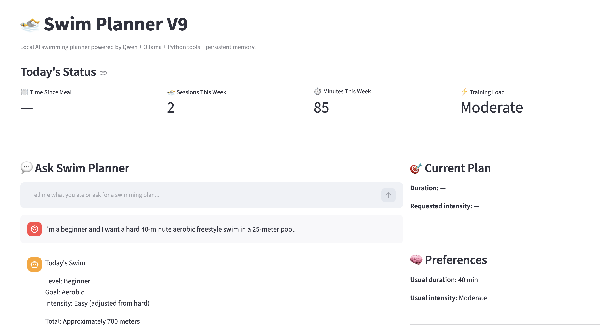

# 🏊 Swim Planner Agent

A local AI agent for personalized swimming planning, built from scratch with **Python, Qwen3:4B, Ollama, and Streamlit**.

The project explores how an LLM can be combined with deterministic tools, structured state, persistent memory, real-time information, and historical data to build a stateful AI application rather than a simple chatbot.

> **V1.0 Local Prototype** — Feature frozen  
> Current model: Qwen3:4B running locally through Ollama

---

## 🎯 Project Goal

The project started with a simple question:

> Can an AI agent recommend when and how I should swim based on what I ate and my recent swimming activity?

The initial prototype was a basic LLM assistant.

It was progressively developed into a stateful agent capable of:

- interpreting natural-language requests
- tracking meal timing in real time
- generating structured swimming workouts
- storing long-term preferences
- recording completed swimming sessions
- analyzing recent training history
- adjusting workout intensity based on recent training load
- exposing internal agent data for debugging
- measuring end-to-end agent latency

The architecture was intentionally implemented largely from scratch rather than starting with an agent framework, in order to understand the underlying mechanics of agent systems.

---

# ✨ Features

## 🍽️ Meal-Aware Planning

The agent extracts meal information from natural language and maintains:

- foods consumed
- meal size
- meal completion time
- real-time minutes since meal

Instead of permanently storing:

```text
minutes_since_meal = 30
```

the system stores a real timestamp:

```text
meal_finished_at = 17:30
```

Python then recalculates elapsed time using the current clock.

This allows the state to evolve with real-world time.

---

## 🏊 Structured Swimming Workouts

The workout tool generates sessions based on:

- swimming level
  - Beginner
  - Intermediate
  - Advanced
- training goal
  - Aerobic
  - Endurance
  - Recovery
  - Speed
- swimming intensity
  - Easy
  - Moderate
  - Hard
- preferred stroke
- pool length
- desired duration

Example output:

```text
40-minute Moderate Aerobic Swim

Warm-up
150 m easy freestyle

Main Set
12 × 50 m freestyle
20 seconds rest

Cool-down
100 m easy

Total Distance
850 m
```

Workout calculations are performed by deterministic Python logic rather than relying entirely on the LLM.

---

## 🔧 Deterministic Tools

The current agent uses four main Python tools:

### 1. Meal Timing Tool

Determines a suggested waiting period based on:

```text
Meal Size
+
Time Since Meal
+
Desired Swimming Intensity
```

---

### 2. Nutrition Analysis Tool

Performs a lightweight classification of meal characteristics such as:

- protein sources
- carbohydrate sources
- higher-fat foods
- sugary foods or drinks

This is intentionally a simple classification tool and not a medical nutrition model.

---

### 3. Swimming Workout Tool

Creates structured distance-based swimming sessions using:

```text
Level
+
Goal
+
Intensity
+
Stroke
+
Pool Length
+
Duration
```

---

### 4. Training Load Tool

Analyzes swimming activity from the previous seven days.

It considers:

- number of sessions
- total swimming minutes
- easy / moderate / hard sessions
- simplified training-load score

The result can influence the recommended intensity of the next workout.

---

# 📊 History-Driven Decision Making

The agent does not simply store swimming history.

Historical data actively influences future decisions.

Example:

```text
Recent History

45 min HARD
40 min HARD

        ↓

Training Load Tool

        ↓

Recommended Intensity
EASY

        ↓

User requests HARD

        ↓

Intensity Decision

Requested: HARD
Recommended: EASY
Final: EASY

        ↓

Workout Tool generates
an EASY session
```

This creates the following decision pipeline:

```text
Past Data
   ↓
Persistent Memory
   ↓
Analysis Tool
   ↓
Decision
   ↓
Workout Tool
   ↓
LLM Explanation
```

---

# 🧠 Memory Architecture

The project distinguishes between different types of information.

## Temporary Structured State

Used for current-session information such as:

```text
Current meal
Meal timestamp
Current workout duration
Current intensity
Swimming level
Training goal
Stroke
Pool length
```

---

## Persistent Long-Term Memory

Stored locally in `memory.json`.

Examples:

```text
Preferred swimming duration
Preferred swimming intensity
Completed swimming sessions
```

The agent distinguishes between temporary statements and information worth remembering.

For example:

```text
"I want a 40-minute swim today."
```

is treated as temporary.

While:

```text
"I usually prefer 40-minute moderate swims."
```

can be stored as a long-term preference.

---

# 🏗️ Architecture

```text
                         USER
                           │
                           ▼
                    Streamlit Web UI
                           │
                           ▼
                     Agent Core
                           │
             ┌─────────────┴─────────────┐
             │                           │
             ▼                           ▼
       Memory Analysis             State Extraction
             │                           │
             ▼                           ▼
     Persistent Memory            Structured State
             │                           │
             └─────────────┬─────────────┘
                           │
                           ▼
                     Python Tools
                           │
            ┌──────────────┼──────────────┐
            │              │              │
            ▼              ▼              ▼
       Meal/Nutrition   Training Load   Workout
            │              │              │
            └──────────────┼──────────────┘
                           │
                           ▼
                  Intensity Decision
                           │
                           ▼
                      Qwen3:4B
                           │
                           ▼
                    Final Response
```

---

# 🧩 Project Structure

```text
swim-planner-agent/
│
├── app.py
│   └── Streamlit web interface and dashboard
│
├── cli.py
│   └── Terminal interface and performance display
│
├── agent_core.py
│   └── Main agent workflow and orchestration
│
├── tools.py
│   └── Deterministic Python tools
│
├── state.py
│   └── Structured and real-time temporary state
│
├── memory.py
│   └── Persistent preferences and swimming history
│
├── prompts.py
│   └── State, memory, and response prompts
│
├── requirements.txt
│
└── README.md
```

`memory.json` and the local Python virtual environment are excluded from Git tracking.

---

# ⚡ Performance Benchmark

One goal of V1 was to understand where latency occurs in a local agent architecture.

Two representative end-to-end tests were recorded using **Qwen3:4B locally through Ollama**.

| Stage | CLI Benchmark | V9 Web Benchmark |
|---|---:|---:|
| Memory Analysis | 24.475 s | 13.49 s |
| State Extraction | 21.551 s | 17.36 s |
| Python Tools | 0.003 s | 0.005 s |
| Final Response | 76.336 s | 89.14 s |
| **Total** | **122.366 s** | **120.00 s** |

### Key Finding

Deterministic Python tools contributed **negligible latency**.

The dominant performance bottleneck was local LLM inference, particularly final-response generation.

Typical end-to-end latency for the current local architecture is approximately:

```text
~120 seconds
```

This benchmark will serve as the baseline for comparison with the future cloud-based architecture.

---

# 💻 Web Interface

The Streamlit interface provides:

- conversational interaction
- real-time meal status
- current workout state
- weekly swimming statistics
- training-load analysis
- persistent swimming history
- developer/debug information
- agent latency measurements

The V9 dashboard also exposes the latency of each major stage:

```text
Memory Analysis
State Extraction
Python Tools
Final Response
Total
```

---

# 🛠️ Technology Stack

### Language

- Python 3.12

### Local LLM

- Qwen3:4B

### Model Runtime

- Ollama

### Web Interface

- Streamlit

### State & Memory

- Python structured state
- JSON persistent storage

### Version Control

- Git
- GitHub

---

# 🚀 Running Locally

## 1. Clone the repository

```bash
git clone https://github.com/suiwenke69-cyber/swim-planner-agent.git
```

Enter the project:

```bash
cd swim-planner-agent
```

---

## 2. Create a virtual environment

```bash
python3 -m venv .venv
```

Activate it on macOS/Linux:

```bash
source .venv/bin/activate
```

---

## 3. Install dependencies

```bash
pip install -r requirements.txt
```

---

## 4. Install and run Ollama

Install Ollama separately and pull the local model:

```bash
ollama pull qwen3:4b
```

---

## 5. Run the web application

```bash
streamlit run app.py
```

Then open:

```text
http://localhost:8501
```

---

## 6. Optional: Run the CLI version

```bash
python cli.py
```

---

# 🧪 Development Evolution

The project was developed incrementally to explore different agent concepts.

```text
V1
LLM + Prompt

↓

V2
Deterministic Tool

↓

V3
Tool Calling

↓

V4
Multi-Tool Agent

↓

V5
Conversation Memory

↓

V5.1
Structured State

↓

V6
Persistent Memory

↓

V6.5
Real-Time State

↓

V7
Professional Swimming Workout Tool

↓

V8
History-Driven Planning

↓

V9
Dashboard + Latency Tracking

↓

V1.0 Local Prototype
Feature Freeze
```

This incremental process exposed several practical agent-development problems, including:

- incorrect tool routing
- unreliable conversational state
- distinction between memory and state
- structured-output failures
- persistence design
- real-world time synchronization
- history-driven decision making
- local inference latency

---

# 💡 Key Engineering Lessons

### LLMs should not do everything

Natural-language understanding is useful for ambiguous inputs, but deterministic calculations are better handled by code.

```text
LLM → Understand ambiguity
Python → Handle certainty
Tools → Perform actions/calculations
State → Represent the present
Memory → Preserve useful past information
```

---

### Memory is not the same as state

Conversation history alone was not reliable enough for maintaining changing numerical information.

Structured state was introduced so that deterministic values could be maintained and updated by Python.

---

### Stored history should influence decisions

Persistent memory becomes more useful when it changes future behavior rather than simply storing information.

V8 therefore introduced:

```text
History → Training Load → Decision → Workout
```

---

### Model inference dominates local latency

Performance measurements showed that Python tool execution was effectively negligible compared with local LLM inference.

This motivates the next architectural iteration.

---

# 🔮 V2 Roadmap

V1.0 intentionally uses a custom agent architecture built largely from scratch.

The next version is planned as a framework-based cloud architecture.

## V2 — Cloud Agent

Planned upgrades:

- OpenAI API
- model-provider abstraction
- LangChain integration
- LangChain tools
- LangGraph state management
- graph-based workflow orchestration
- conditional routing
- improved structured outputs
- cloud deployment
- V1 vs V2 latency benchmarking

Planned architecture:

```text
                 Streamlit
                     │
                     ▼
                  LangGraph
                     │
            ┌────────┼────────┐
            ▼        ▼        ▼
          State     Tools    Memory
            │        │        │
            └────────┼────────┘
                     │
                     ▼
                 OpenAI API
                     │
                     ▼
               Final Response
```

The same benchmark workload will be used to compare the local and cloud architectures.

---

# ⚠️ Disclaimer

This project is an educational prototype designed to explore AI-agent architecture and swimming-planning workflows.

The meal-timing, nutrition, training-load, and workout rules are simplified planning heuristics.

They are **not medical advice, professional coaching advice, or a substitute for qualified medical or sports professionals**.

---

# 📌 Version

**Current release:** `v1.0-local`

**Status:** Feature frozen

**Architecture:** Custom local agent

**Model:** Qwen3:4B via Ollama

**Interface:** Streamlit + CLI

## 🖥️ V9 Dashboard

